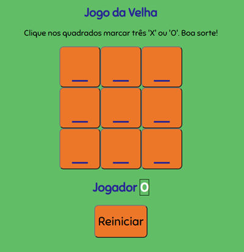

# Jogo da Velha #️

Jogo da Velha feito em HTML, CSS e JS.

Link para o site: https://gabivechiatto.github.io/Jogo_da_Velha/

 

<h2>Como usar?</h2>

1. O jogo é para ser jogado em duas pessoas, e o O e X será escolhido de maneira aleatória pelo sistema.

2. Para iniciar, o primeiro jogador clica no campo desejado.

3. Os jogadores vão alternando a vez, e ganha quem fizer em uma linha completa (horizontal, vertical ou diagonal) o X ou O.

4. Ao ganhar, a linha ficará branca.

5. Clique em Reiniciar para resetar o jogo.

<h2>Licença</h2>

MIT (Massachusetts Institute of Technology)

